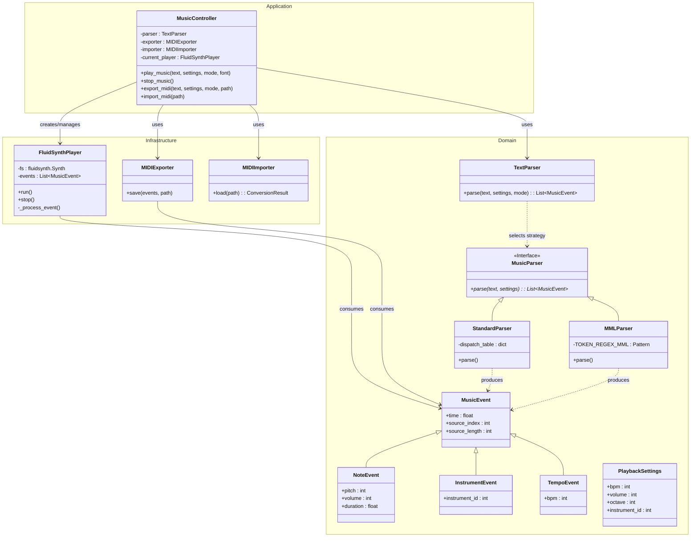

# `txt2midi`

A Python-based graphical application designed to convert textual musical notation into MIDI files and provide real-time audio playback. The application features a native graphical user interface built for the GNOME ecosystem using GTK4, Libadwaita, and PyGObject. This software was originally developed as an academic project for the INF01120 (Técnicas de Construção de Programas) course at the Universidade Federal do Rio Grande do Sul (UFRGS).

## Features

* **Text-to-music parsing:** Supports two distinct parsing strategies: a Standard free-text mapping mode and Music Macro Language (MML) for precise control over pitch, octaves, and durations.
* **Real-time playback:** Integrates FluidSynth (`pyfluidsynth`) to synthesize and play audio directly within the application using SoundFont (`.sf2`) files, eliminating subprocess latency.
* **Visual feedback:** Provides real-time syntax highlighting and playback synchronization utilizing `GtkSourceView` with custom `.lang` configurations.
* **MIDI export and import:** Enables compiling textual compositions into standard `.mid` files using `midiutil`, and transpiling existing MIDI files back into editable text utilizing `mido`.
* **Declarative UI:** Utilizes GNOME Blueprint markup for defining the user interface view layer concisely, separating layout definitions from Python logic.

## Architecture

The project follows an Object-Oriented design adhering to layered architecture patterns:

* **Domain layer:** Defines core models (`PlaybackSettings`, `ParsingContext`), events (`MusicalEvent`, `NoteEvent`), and polymorphic parsing strategies (`StandardParser`, `MMLParser`).
* **Infrastructure layer:** Manages external I/O interactions, including audio synthesis via a threaded `FluidSynthPlayer`, MIDI generation (`MIDIExporter`), and parsing linear tracks to monophonic text (`MIDIImporter`).
* **Application layer:** Routes user interface interactions to the domain logic through a central `MusicController`.
* **Presentation layer:** A dynamic GUI styled via Blueprint templates, utilizing PyGObject introspection to bind Python classes to underlying C-based GTK4 and Libadwaita libraries.

